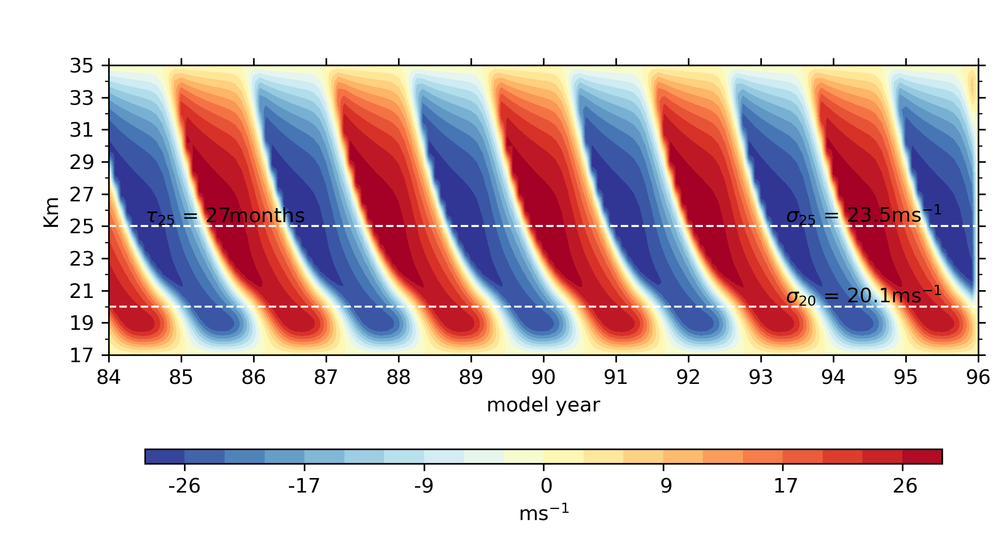

## Description
A PyTorch 1D QBO model.

The essential components of the code include:
- A class for solving a forced advection-diffusion equation in one space
 dimension, located in `./src/adsolver.py`.
- A wrapper for setting up the source term `make_source_func`, located in
 `./src/utils`, which can be used to set up the analytic source term or load an
 emulator of the source terms (essentially an PyTorch model).

**Features**:
- Can be forced using a spectrum of waves.

<p align="right">(<a href="#top">back to top</a>)</p>


## "Installation"
The code requires (imports) PyTorch, NumPy, Matplotlib, and SciPy. To enjoy the
 example notebook you will also need Jupyter Notebook. A tested environment is
 provided in `qbo1d-environment-spec-file.txt` and can be replicated as follows:

```sh
conda create --name qbo1d --file qbo1d-environment-spec-file.txt
conda activate qbo1d
```

<p align="right">(<a href="#top">back to top</a>)</p>


## Documentation
Please refer to the [Documentation](https://ofershamir.github.io/qbo1d/).


<p align="right">(<a href="#top">back to top</a>)</p>


## Working example
A working example is provided in the `example.ipynb` notebook. Here is a figure.
 The forcing in the figure consists of two waves of equal and opposite
 amplitudes &plusmn; 6 mPa, opposite phase speeds &plusmn; 32 m s<sup>-1</sup>,
 and equal wavenumbers 1. The vertical advection in this case equals
 10<sup>-5</sup> m s<sup>-1</sup>. Note, the figure shows the
 **last 12 years of a 96 year** long integration. The amplitudes and period
 estimates were estimated after 12 years of spinup.



<p align="right">(<a href="#top">back to top</a>)</p>

